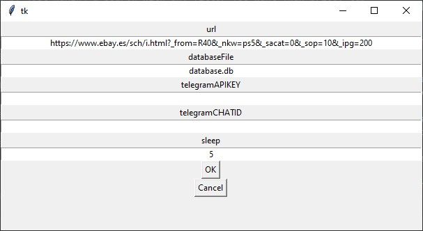

# Basic eBay auto searcher

This is a pretty basic python script designed for getting every eBay listing link from a specific search.
The url list will be printed on console and also can be sent to a telegram account as a text message. 

It will search for new products every X seconds

### Pre-requirements 📋

You can quickly install all the requirements by using the well known 

```
pip install -r requirements.txt
```

### Usage
To execute this script, just run "python scraper.py"
If you are on Windows, you can also download the .exe version on the releases section and run "scraper.exe". You don't need to install python to make it work.

When you run the program, it will display a GUI that contains the configuration of the eBay search url, database file location, sleep time, the telegram bot API Key 
and the telegram chatid that is going to receive the message. This two previous parameters are 
optional so you can just specify them as an empty string (""). Check the [example config](example.json) for reference

### Obtaining the URL and setting the parameters




    eBay search URL can be get by just making a search with any filter you want (max price, location, only bids, etc)
    and copying the browser URL
    
    The databaseFile parameter contains the file path where it stores a database. 
    This database will register every found listing so the program can only show (and send to telegram) new listings without duplicates
    
    The sleep parameter specifies a number of seconds. This is the amount of time that the scraper will wait for every search
    
    Telegram API Key is retrieved when you create a new telegram bot on @BotFather

    The telegram chatid can be retrieved when you send a message to @userinfobot on telegram


### TODO
* Make the script search for multiple pages
* Remove old database entries
* Show more detailed info about every listing (price, country, etc)
* Make a nice README


I'm developing this script for my own learning purposes so the script functionality may vastly change on the following weeks


